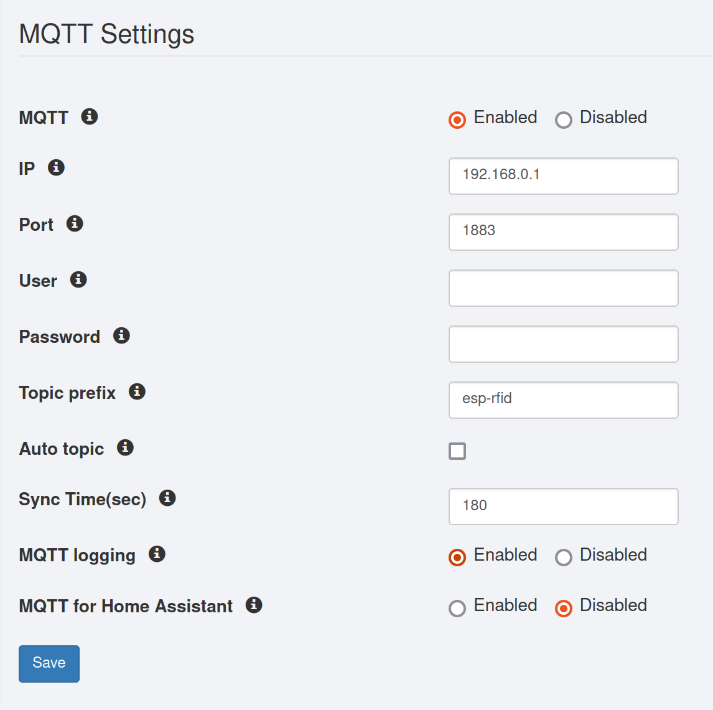

# ESP RFID with extended MQTT Functions

Hardware:
* Any esp-rfid board like esp-rfid-relay-board, marelab ESP-DOOR

This has been added so far:
* Reading all user data over MQTT
* Sending User data to RFID-DOOR/ESP-RFID over MQTT
* Sending door open command over MQTT
* Sending door status over MQTT as event
* Sending Sync of a RFID-DOOR (IP/Hostname) over MQTT
* Configure Sync interval over ESP-RFID GUI
* Deleting all User of a ESP-RFID device over MQTT
* Sending log event & access data over MQTT
* Demo NODE-RED flow & GUI to centralize managment of ESP-RFID devices & users

## Broker settings
You can add all the broker details in the web UI:

 <- to update

## Using MQTT Topics
For the MQTT communication some additional TOPICs have been added internally. The default Topic is configured in the web UI. If you use more then one device, every device should have the same `TOPIC` name configured. All MQTT communication is done with JSON Payload as MQTT Message.

This is the used Topic hierarchy:

```
TOPIC---+---/send
        |
        +---/cmd
```

  e.g. if you configure in the web UI `TOPIC` = "/rfid" these topic queues can be used:
  * /rfid
  * /rfid/send
  * /rfid/cmd

### Auto-topic

If auto-topic option is selected, esp-rfid will add the last 6 characters from the device MAC address to the MQTT topic.

This can be useful to deploy a batch of esp-rfid in one go. By knowing the MAC addresses in advance you can setup them all with a standard configuration and each one will talk on a separate topic.

## Commands received by ESP-RFID
The message format is JSON.

The message has to include the IP of the device together with one of the supported commands.

The commands should be sent to the `TOPIC/cmd` and the responses will be sent on  the topic `TOPIC/send`.

### Get all the users
When sending the following command:
```
{
   "cmd":"getuserlist",
   "doorip":"(The ESP-RFID IP address as String)"
}
```

A list of messages like the following will be sent, one for each user:
```
{
    "command": "userfile",
    "uid": "1234",
    "user": "User Name",
    "acctype": 1,
    "acctype2": null,
    "acctype3": null,
    "acctype4": null,
    "validsince": 0,
    "validuntil": 1608336000
}
```

### Open door
Opens the Door/Magnetic Lock.

Command:
```
{
    "cmd":"opendoor",
    "doorip":"(The ESP-RFID IP of the door to open as String)"
}
```

Response will be a standard [Publish Access](#publish-access) message.

### Delete user
Delete a single user by UID.

Command:
```
{
     "cmd":"deletuid",
     "doorip":"(The ESP-RFID IP address as String)",
     "uid":"(The UID of the user to delete as String)"
}
```

Response will be an acknowledgment to let the other party know that the message was processed:
```
{
  "type":"deletuid",
  "ip":"192.168.1.xxx",
  "hostname":"your esp-rfid hostname"
}
```

### Delete all users
Delete all user files.

Command:
```
{
     "cmd":"deletusers",
     "doorip":"(The ESP-RFID IP address as String)"
}
```

Response will be an acknowledgment to let the other party know that the message was processed:
```
{
  "type":"deletusers",
  "ip":"192.168.1.xxx",
  "hostname":"your esp-rfid hostname"
}
```

### Add user
Adds a user as a file to the device.

Command:
```
{
     "cmd":"adduser",
     "doorip":"(The ESP-RFID IP address as String)",
     "uid": "(The PIN as String)",
     "user": "(User Name as String)",
     "acctype": "1",
     "validsince": "0",
     "validuntil": "1608466200"
}
```
* _acctype_
  * 0 = Disabled
  * 1 = Always
  * 99 = Admin

* _validsince_
  * User valid since date/time as Unix epoch timestamp
  * Can send calculations based on now:
    * ```validsince: {{ (as_timestamp(now()) + (2*24*3600)) }}```

* _validuntil_
  * Expiration date/time as Unix epoch timestamp
  * Can send calculations based on now:
    * ```validuntil: {{ (as_timestamp(now()) + (2*24*3600)) }}```

Response will be an acknowledgment to let the other party know that the message was processed:
```
{
  "type":"adduser",
  "ip":"192.168.1.xxx",
  "hostname":"your esp-rfid hostname"
}
```

### Get configuration
Get the global configuration.

Command:
```
{
     "cmd":"getconf",
     "doorip":"(The ESP-RFID IP address as String)"
}
```

Response will be an object with a `configfile` key which holds the entire configuration object. The same object that you can download from the "Backup & Restore" section.
```
{
  "type":"getconf",
  "ip":"192.168.1.xxx",
  "hostname":"your esp-rfid hostname",
  "configfile": {
    // the entire configuration object
  }
}
```

### Update configuration
Update the global configuration. You can pass a configuration object, which will be used as the new configuration. Then the system will restart to load the new configuration.

Command:
```
{
     "cmd":"updateconf",
     "doorip":"(The ESP-RFID IP address as String)",
     "configfile": {
      // the entire configuration object
     }
}
```

Response will be an acknowledgment to let the other party know that the message was processed:
```
{
  "type":"updateconf",
  "ip":"192.168.1.xxx",
  "hostname":"your esp-rfid hostname"
}
```

Then the system will automatically restart to use the new configuration.

## Messages sent by ESP-RFID
ESP-RFID sends a set of MQTT messages for the most significant actions that it does, plus can be configured to send all the logs over MQTT, instead of keeping them locally.

All the messages are sent at the topic: `TOPIC/send`.

For Home Assistant, check the specific topics and messages below.

### Base messages

#### Boot
Once booted and connected to the WiFi, it sends this message.

```
{
  "type":"boot",
  "time":1605987212,
  "uptime":0,
  "ip":"192.168.1.xxx",
  "hostname":"your esp-rfid hostname"
}
```

#### Heartbeat
Every X seconds ESP-RFID sends a heartbeat over MQTT. The interval can be customised in the web UI, the default is 180 seconds.

```
{
  "type":"heartbeat",
  "time":1605991375,
  "uptime":999,
  "ip":"192.168.1.xxx",
  "hostname":"your esp-rfid hostname"
}
```

#### Publish Access
When a RFID token is detected a set of messages can be sent, depending on the presence of the token UID in the database.

If the UID is in the users list, there can be a set of possible "access" configurations. It can be:

* `Admin` for admin users
* `Always` for access enabled
* `Disabled` for access disabled
* `Expired` for access expired

```
{
  "type":"access",
  "time":1605991375,
  "isKnown":"true",
  "access":"the access state",
  "username":"username",
  "uid":"token UID",
  "hostname":"your esp-rfid hostname",
  "doorName":"your door name"
}
```
If instead the UID is not present in the users list the message will be:

```
{
  "type":"access",
  "time":1605991375,
  "isKnown":"false",
  "access":"Denied",
  "username":"Unknown",
  "uid":"token UID",
  "hostname":"your esp-rfid hostname"
}
```

If the tag is unknown the message will be different:

```
{
  "type":"WARN",
  "src":"rfid",
  "desc":"Unknown rfid tag is scanned",
  "data":"",
  "time":1605991375,
  "cmd":"event",
  "hostname":"your esp-rfid hostname"
}
```

In case of multiple doors managed by one esp-rfid, you'll get an array for doorname and for access:

```
{
  "type":"access",
  "time":1605991375,
  "isKnown":"true",
  "access":["the access state door 1", "access state door 2"],
  "username":"username",
  "uid":"token UID",
  "hostname":"your esp-rfid hostname",
  "doorName":["door 1", "door 2"]
}
```

### Log messages
Besides the above messages, ESP-RFID can send all the logs via MQTT instead of storing those locally. If this is enabled via the web UI, also the following messages are sent.

#### Door status
If the door sensor is enabled, two messages are sent, one when the door is opened:

```
{
  "type":"INFO",
  "src":"door",
  "desc":"Door Open",
  "data":"",
  "time":1605991375,
  "cmd":"event",
  "hostname":"your esp-rfid hostname"
}
```

And one when the door is closed:

```
{
  "type":"INFO",
  "src":"door",
  "desc":"Door Closed",
  "data":"",
  "time":1605991375,
  "cmd":"event",
  "hostname":"your esp-rfid hostname"
}
```

#### Doorbell
If the doorbell is enabled, a message is sent when it's ringing:

```
{
  "type":"INFO",
  "src":"doorbell",
  "desc":"Doorbell ringing",
  "data":"",
  "time":1605991375,
  "cmd":"event",
  "hostname":"your esp-rfid hostname"
}
```

#### Tamper status
If the door is tampered, or open when it shouldn't be a message is sent:

```
{
  "type":"WARN",
  "src":"tamper",
  "desc":"Door was tampered!",
  "data":"",
  "time":1605991375,
  "cmd":"event",
  "hostname":"your esp-rfid hostname"
}
```

And then if the open is not closed before the maximum allowed time:

```
{
  "type":"WARN",
  "src":"tamper",
  "desc":"Door wasn't closed within max open time!",
  "data":"",
  "time":1605991375,
  "cmd":"event",
  "hostname":"your esp-rfid hostname"
}
```

#### WiFi status
Some messages around WiFi handling are also sent.

Enabling/disabling of WiFi:

```
{
  "type":"INFO",
  "src":"wifi",
  "desc":"WiFi is going to be disabled / Enabling WiFi",
  "data":"",
  "time":1605991375,
  "cmd":"event",
  "hostname":"your esp-rfid hostname"
}
```

#### MQTT status
MQTT connection or message handling related.

On connecting to the broker:
```
{
  "type":"INFO",
  "src":"mqtt",
  "desc":"Connected to MQTT Server",
  "data":"Session Present",
  "time":1605991375,
  "cmd":"event",
  "hostname":"your esp-rfid hostname"
}
```

On disconnecting from the broker:
```
{
  "type":"WARN",
  "src":"mqtt",
  "desc":"Disconnected from MQTT server",
  "data":"reason of disconnection",
  "time":1605991375,
  "cmd":"event",
  "hostname":"your esp-rfid hostname"
}
```

When the ESP8266 cannot store in memory incoming messages due to low memory a message will be sent back:
```
{
  "type":"ERRO",
  "src":"mqtt",
  "desc":"Dropping MQTT message, out of memory",
  "data":"",
  "time":1605991375,
  "cmd":"event",
  "hostname":"your esp-rfid hostname"
}
```

#### System messages
When the system configuration is done and the system is up and running
```
{
  "type":"INFO",
  "src":"sys",
  "desc":"System setup completed, running",
  "data":"",
  "time":1605991375,
  "cmd":"event",
  "hostname":"your esp-rfid hostname"
}
```

Before performing a requested reboot:
```
{
  "type":"INFO",
  "src":"sys",
  "desc":"System is going to reboot",
  "data":"",
  "time":1605991375,
  "cmd":"event",
  "hostname":"your esp-rfid hostname"
}
```

Before performing a scheduled reboot:
```
{
  "type":"WARN",
  "src":"sys",
  "desc":"Auto restarting...",
  "data":"",
  "time":1605991375,
  "cmd":"event",
  "hostname":"your esp-rfid hostname"
}
```

On a FS format:
```
{
  "type":"WARN",
  "src":"sys",
  "desc":"Filesystem formatted",
  "data":"",
  "time":1605991375,
  "cmd":"event",
  "hostname":"your esp-rfid hostname"
}
```

When saving the configuration on SPIFFS:
```
{
  "type":"INFO",
  "src":"sys",
  "desc":"Config stored in the SPIFFS",
  "data":"xxx bytes",
  "time":1605991375,
  "cmd":"event",
  "hostname":"your esp-rfid hostname"
}
```

After deleting all the event logs:
```
{
  "type":"WARN",
  "src":"sys",
  "desc":"Event log cleared!",
  "data":"",
  "time":1605991375,
  "cmd":"event",
  "hostname":"your esp-rfid hostname"
}

After deleting all the access logs:
```
{
  "type":"WARN",
  "src":"sys",
  "desc":"Latest Access log cleared!",
  "data":"",
  "time":1605991375,
  "cmd":"event",
  "hostname":"your esp-rfid hostname"
}

When starting the firmware update:
```
{
  "type":"INFO",
  "src":"updt",
  "desc":"Firmware update started",
  "data":"file name",
  "time":1605991375,
  "cmd":"event",
  "hostname":"your esp-rfid hostname"
}

If there's no space to upload the firmware:
```
{
  "type":"ERRO",
  "src":"updt",
  "desc":"Not enough space to update",
  "data":"",
  "time":1605991375,
  "cmd":"event",
  "hostname":"your esp-rfid hostname"
}

If the firmware update failed because it's not possible to write on flash:
```
{
  "type":"ERRO",
  "src":"updt",
  "desc":"Writing to flash is failed",
  "data":"file name",
  "time":1605991375,
  "cmd":"event",
  "hostname":"your esp-rfid hostname"
}

If the firmware update successfully finished:
```
{
  "type":"INFO",
  "src":"updt",
  "desc":"Firmware update is finished",
  "data":"",
  "time":1605991375,
  "cmd":"event",
  "hostname":"your esp-rfid hostname"
}

If the firmware update failed:
```
{
  "type":"ERRO",
  "src":"updt",
  "desc":"Update is failed",
  "data":"",
  "time":1605991375,
  "cmd":"event",
  "hostname":"your esp-rfid hostname"
}

### Home Assistant messages

#### Boot sequence
When esp-rfid finishes the boot sequence and connects to WiFi and MQTT broker sends HA-specific messages to setup: lock, door, doorbell, tag, user, door tamper, avty.

#### IO messages
During normal usage, esp-rfid sends to Home Assistant messages on the `/io/*` topics for the following:
- door status, open/closed
- door tamper
- doorbell on/off
- lock locked/unlocked


#### Publish access
Similarly to what is published for the standard MQTT settings, when Home Assistant is setup, esp-rfid sends a set of messages when a rfid card is swiped.

Read above for the possible cases, the significant part fo HA is that the topic to which the message is sent is different: `TOPIC/tag`.

And the message looks like this:

```
{
  "uid":"token UID",
  "username":"username",
  "access":"the access state",
  "time":1605991375,
 }
```
